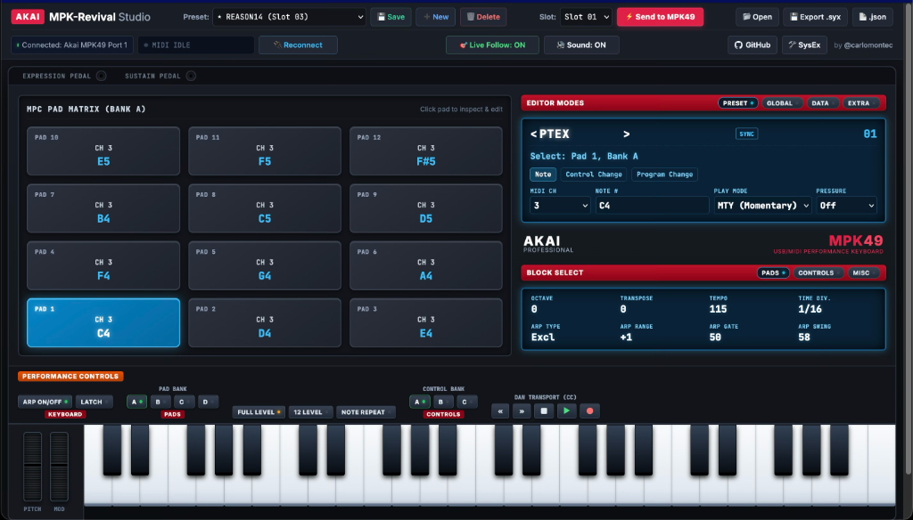

# MPK-Revival 🎹

A Web MIDI editor, SysEx librarian, and open hardware specification for the **Akai MPK49**. No installs, no legacy drivers—runs in Chrome/Edge/Brave via the Web MIDI API.



> [!WARNING]
> Experimental. Back up your presets before flashing anything to hardware.

---

## Why This Exists

The Akai MPK49 is genuinely one of the best MIDI controllers ever made—semi-weighted keys with aftertouch, velocity-sensitive MPC pads, 360° encoders, long-throw faders. Built to last decades. Musicians still use them daily.

What wasn't built to last was the software. When inMusic acquired Akai Professional, they discontinued all editor support for the MPK series without releasing source code, documentation, or a migration path. The official **Vyzex MPK49** editor was abandoned as a 32-bit binary—it stopped working on macOS Catalina (2019) and Windows 11 64-bit. That's a lot of years of silence on a product people paid real money for.

No SDK. No SysEx protocol docs. No replacement. Just a great controller with no way to back up or edit presets from a computer.

MPK-Revival is the community answer: a fully reverse-engineered open spec and a modern web-based editor, so the MPK49 gets the software support Akai never provided.

---

## Quick Start

```bash
cd editor && python3 -m http.server 8080
```

Open **[http://localhost:8080](http://localhost:8080)**, connect the MPK49 via USB, click **`[🔌 Connect MIDI]`**, and set `🎹 MPK on Desk:` to the slot currently loaded on the keyboard. Touch any physical control—the editor jumps to it in real time.

---

## What It Does

- **Web MIDI Studio** — Visual editor for all 30 preset slots. Live hardware sensing: touch a knob, fader, or pad and the UI highlights it instantly.
- **SysEx Librarian** — Read, edit, and write presets directly to/from keyboard memory.
- **Open Hardware Spec** — Full reverse-engineered 1,033-byte memory map: [`docs/AKAI_MPK49_SYSEX_SPECIFICATION.md`](docs/AKAI_MPK49_SYSEX_SPECIFICATION.md)
- **AI Preset Architect** — Semantic JSON presets that compile to verified `.syx` files via `tools/compile_preset.js`.

---

## Memory Map (Summary)

| Block | Range | Size |
| :--- | :--- | :--- |
| SysEx Header | `0x0000..0x0006` | 7 B — `F0 47 00 6B 10 08 01` |
| Slot Number | `0x0007` | 1 B — `0x01`..`0x1E` |
| Preset Name | `0x0008..0x000F` | 8 B — ASCII, mixed case supported |
| Global / Arpeggiator | `0x0010..0x002B` | 28 B |
| MPC Drum Pads | `0x002C..0x022B` | 512 B — 4 banks × 12 pads × 8 B |
| Rotary Knobs K1–K8 | `0x022C..0x02D3` | 168 B — 3 banks × 8 knobs × 7 B |
| Faders F1–F8 | `0x02D4..0x034B` | 120 B — 3 banks × 8 faders × 5 B |
| Switches S1–S8 | `0x034C..0x03F3` | 168 B — 3 banks × 8 switches × 7 B |
| Wheels & Pedals | `0x03F4..0x0407` | 20 B |
| SysEx End | `0x0408` | 1 B — `0xF7` |

---

## Repository Structure

```
mpk-revival/
├── editor/                  # Web MIDI Studio
│   ├── index.html
│   ├── css/
│   └── js/
│       ├── app.js           # UI, live hardware sensing, drag & drop
│       ├── sysex_schema.js  # 1,033-byte encoder/decoder + fromJSON/toSemanticJSON
│       ├── midi_engine.js   # Web MIDI API driver
│       └── factory_data.js  # All 30 factory presets (base64 ROM dumps)
├── presets/                 # Studio presets (JSON + compiled .syx)
│   ├── ableton12_studio.*   # Slot 02 — 8 Macros, 8 Faders, 8 Track Mutes, Drum Rack pads
│   ├── reason14_rack.*      # Slot 03 — Combinator Rotaries, Mixer Faders, Kong pads
│   └── kontakt_orchestral.* # Slot 16 — CC1/11 Dynamics, Quick Controls, Articulation switches
├── tools/
│   └── compile_preset.js    # CLI: validates JSON → outputs verified 1,033-byte .syx
├── docs/
│   ├── AKAI_MPK49_SYSEX_SPECIFICATION.md
│   ├── AGENT_PRESET_CREATION_GUIDE.md
│   └── assets/
├── backups/                 # All 30 original factory presets (JSON + SYX)
└── AGENTS.md                # Development rules & constraints
```

---

## AI Preset Workflow

To create a custom preset, ask an AI agent to generate a semantic JSON file in `presets/`. The agent researches the MIDI CC map for your instrument, lays out controls ergonomically, then compiles and validates the `.syx`:

```bash
node tools/compile_preset.js presets/my_preset.json
```

Drag the resulting `.json` or `.syx` into the Web Studio, review it, and press **`[⚡️ Send to MPK49]`** to flash it.

See [`docs/AGENT_PRESET_CREATION_GUIDE.md`](docs/AGENT_PRESET_CREATION_GUIDE.md) for the full authoring spec.

---

## Contributing

PRs and hardware dumps welcome—especially from **MPK25**, **MPK61**, and **MPK88** users (architecture is compatible but offsets may differ). Open an issue or PR.

- **Author**: [@carlomontec](https://github.com/carlomontec)
- **License**: MIT © 2026
- **AI Assistance**: Reverse-engineering workflow, SysEx parser, Web MIDI driver, and visual editor pair-programmed with [Google Gemini](https://deepmind.google/technologies/gemini/) via **Google Antigravity (AGY)**.
